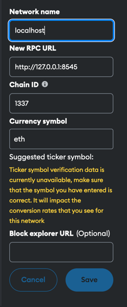
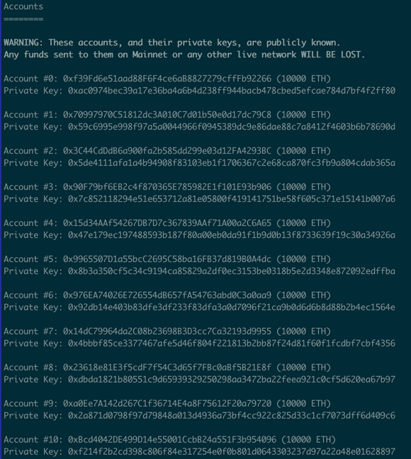

# Eigen Reward Project 

## Overview
The Eigen Reward Project enables users to claim Eigen tokens based on existing Ethereum holdings. Users can claim 4 Eigen tokens per 1 ETH. 


## Project Structure
```
project-root
│
├── /contract                 # Smart contract directory
│   └── /contracts
│     └── EigenToken.sol      # Smart contract for minting EIGEN tokens
└─── /App                     # Next.js application
│    ├── /reward               # Next.js reward page
│    └── /api                  # Next.js reward route
└─── Dockerfile     
```

## Localhost Setup Instructions
### Run Hardhat Locally
1. **Set up .Env file**
   ```
   cp env.test .env
   ```
2. **Run Hardhat**
   ```bash
   cd contract
   npm install
   npm run node
   ```
3. **Deploy Eigen Contract**: Run the following command to deploy the Eigen contract from the `contract` directory:
   ```bash
   npm run deploy 
   ```
4. **Test and Help**: Run the following command to test the Eigen contract:
   ```bash
   npx hardhat help
   npx hardhat test test/Eigen.test.ts  # Ensure the test file is located in the `test` directory.
   ```

### Set Up Wallet
1. **Set Up Network on Wallet**: Ensure your wallet (e.g., MetaMask) is set up to connect to the appropriate network.
    
     

2. **Import Wallet**: Import from any of the following accounts outputted on the Hardhat server log.
    

### Running the Next.js App
1. **Install Dependencies**: In the root directory 
   ```bash
   yarn 
   ```
2. **Start the App**: 
   ```bash
   yarn dev 
   ```
3. **Access the Application**:
   ```
   http://localhost:3000 
   ```

## Docker Instruction(Sepolia only)

1. **Ensure Docker is Installed and running**:  you can download it from [Docker's official website](https://www.docker.com/get-started).

2. **Pull the Docker Image**: 
   ```bash
   docker pull richellej/eigan-reward-dapp:latest
   ```

3. **Run the Docker Container**: Use the following command to run the Docker container:
   ```bash
   docker run -d --name eigan-reward-dapp -p 3000:3000 richellej/eigan-reward-dapp:latest
   ```
4. **Access the Application**:
   ```
   http://localhost:3000 
   ```
5. **Use the Sepolia network on wallet**, see earlier screenshot for private keys,  wallet config as follows: 
   ```
   Network Name - Sepolia Testnet
   New RPC URL - https://eth-sepolia.g.alchemy.com/v2/[YOUR-API-KEY] //you would need a rpc url
   Chain ID - 11155111
   Currency Symbol - SepoliaETH
   Block explorer URL - https://sepolia.etherscan.io/
   ```
### Test on Sepolia 
1. **Claim Eth on Sepolia**: you would need more than one eth to get rewards  
   
   * [Sepolia Faucet Chainlink](https://faucets.chain.link/sepolia)
   * [Sepolia Faucet Alchemy](https://www.alchemy.com/faucets/ethereum-sepolia)
   
   
**Note:** The Sepolia Eigan contract is:
* deployed at the following address: 
[0xD4f742A28b5938626aCd978D57424cc968099FE0](https://sepolia.etherscan.io/address/0xD4f742A28b5938626aCd978D57424cc968099FE0) 
* and deployed with```0xabcD57bb0B0Cd9717DbCEE503b371CAec405ccC4```

## See Demo


## License
This project is licensed under the MIT License - see the [LICENSE](LICENSE) file for details.

